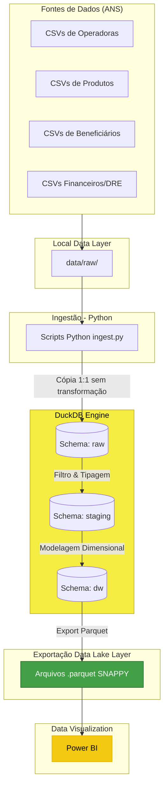
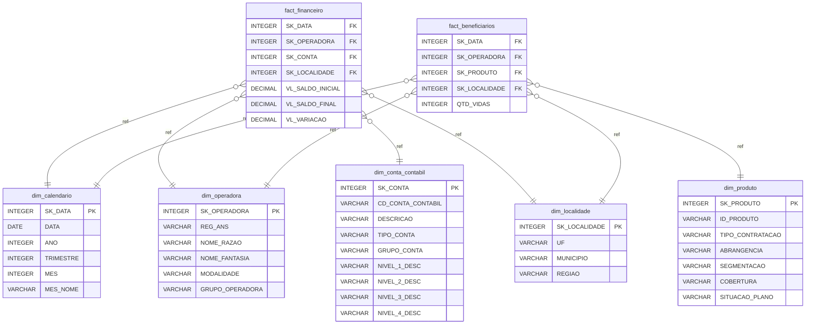

# Arquitetura do Projeto — Case Analytics Unimed

Este documento descreve a arquitetura de dados e de fluxo do projeto, evidenciando as camadas de processamento, as tecnologias envolvidas e a modelagem final.

## 1. Visão Geral da Arquitetura (ELT)

O projeto adota a arquitetura **ELT (Extract, Load, Transform)**, priorizando o uso de SQL para transformações através do motor analítico DuckDB. 

Abaixo, um diagrama Mermaid ilustrando o fluxo de dados desde os arquivos brutos da ANS até a visualização no Power BI:

### Tecnologias Utilizadas

- **Fonte Receptora:** Arquivos CSV/Text.
- **Orquestração e Ingestão:** Python puro.
- **Motor Analítico (Processamento e DW):** DuckDB (local único arquivo `unimed.duckdb`).
- **Formato Otimizado de Armazenamento:** Apache Parquet (compressão SNAPPY).
- **Consumo Visual Analytics:** Microsoft Power BI.

---

## 2. Modelagem de Dados — Star Schema

A modelagem de dados no Data Warehouse (schema `dw`) foi formatada sob o padrão **Star Schema**, com base na metodologia de consolidação de dimensões conformadas.

### Características Chaves da Modelagem:
- **Ausência de Constraints Físicas:** Não existem Primary Keys, Foreign Keys ou `NOT NULL` nas tabelas finais. O DuckDB no perfil "Data Warehouse" é otimizado para não gastar recursos validando os dados na carga final. A integridade existe devido à lógica validada na camada de Transformação.
- **Campos de Chave Surrogate:** Todas as tabelas fato ligam-se às dimensões por uma Surrogate Key gerada sequencialmente (`SK_NOME`).
- **Idempotência:** Todo o modelo é gerado a partir de `CREATE OR REPLACE TABLE`, tornando a execução reprocessável do início ao fim sem risco de duplicação.
