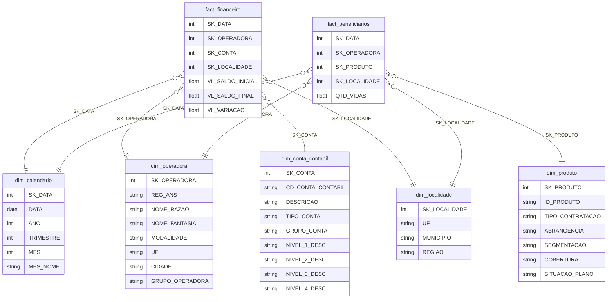

# Documentação do Modelo PBI
> Gerado a partir dos arquivos TMDL do Semantic Model

---

## 1. Visão Geral

| Atributo | Valor |
|---|---|
| Arquivo | `case_unimed.pbip` |
| Páginas | 2 |
| Tabelas no modelo | 7 |
| Tabelas fato | 2 |
| Tabelas dimensão | 5 |
| Tabela de medidas | 1 (`_Medidas`) |
| Fonte dos dados | Arquivos `.parquet` em `data/dw/` |

---

## 2. Páginas do Relatório

| # | Nome | Resolução | Background |
|---|---|---|---|
| 1 | **Panorama de Mercado** | 1366 × 768 | `background8817002190778797.png` |
| 2 | **Saúde Financeira** | 1366 × 768 | `background6898293324491024.png` |

### Página 1 — Panorama de Mercado

| Tipo de Visual | Quantidade |
|---|---|
| Slicer (segmentação) | 5 |
| Card | 4 |
| Gráfico de colunas agrupadas | 2 |
| Gráfico de rosca (donut) | 2 |
| Gráfico de barras 100% empilhadas | 1 |
| Imagem | 1 |

### Página 2 — Saúde Financeira

| Tipo de Visual | Quantidade |
|---|---|
| Slicer (segmentação) | 5 |
| Card | 4 |
| Gráfico de colunas | 1 |
| Gráfico de barras agrupadas | 1 |
| Gráfico de rosca (donut) | 1 |
| Tabela dinâmica (pivot) | 2 |
| Imagem | 1 |

---

## 3. Modelo de Dados — Star Schema

### Diagrama de Relacionamentos



> **Nota:** Sem constraints físicas (PK/FK). Integridade garantida pelo processo ELT. As surrogate keys são colunas simples usadas para joins no modelo semântico.

---

## 4. Dicionário de Dados

### `fact_financeiro`
Tabela fato com dados financeiros (DRE/Balancete) por operadora e período.

| Coluna | Tipo | Descrição |
|---|---|---|
| SK_DATA | INT64 | Surrogate key → `dim_calendario` |
| SK_OPERADORA | INT64 | Surrogate key → `dim_operadora` |
| SK_CONTA | INT64 | Surrogate key → `dim_conta_contabil` |
| SK_LOCALIDADE | INT64 | Surrogate key → `dim_localidade` |
| VL_SALDO_INICIAL | DOUBLE | Saldo no início do período |
| VL_SALDO_FINAL | DOUBLE | Saldo no final do período |
| VL_VARIACAO | DOUBLE | Diferença entre saldo final e inicial |

**Fonte:** `data/dw/fact_financeiro.parquet`

---

### `fact_beneficiarios`
Tabela fato com quantidade de vidas por operadora, produto e período.

| Coluna | Tipo | Descrição |
|---|---|---|
| SK_DATA | INT64 | Surrogate key → `dim_calendario` |
| SK_OPERADORA | INT64 | Surrogate key → `dim_operadora` |
| SK_PRODUTO | INT64 | Surrogate key → `dim_produto` |
| SK_LOCALIDADE | INT64 | Surrogate key → `dim_localidade` |
| QTD_VIDAS | DOUBLE | Quantidade de beneficiários ativos |

**Fonte:** `data/dw/fact_beneficiarios.parquet`

---

### `dim_calendario`
Dimensão de tempo. Usada como eixo temporal em ambas as fatos.

| Coluna | Tipo | Descrição |
|---|---|---|
| SK_DATA | INT64 | Chave surrogate (PK lógica) |
| DATA | DATETIME | Data completa |
| ANO | INT64 | Ano (ex: 2025) |
| TRIMESTRE | INT64 | Trimestre numérico (1–4) |
| MES | INT64 | Mês numérico (1–12) |
| MES_NOME | STRING | Nome do mês em PT-BR |

**Fonte:** `data/dw/dim_calendario.parquet`

---

### `dim_operadora`
Cadastro das operadoras de saúde registradas na ANS.

| Coluna | Tipo | Descrição |
|---|---|---|
| SK_OPERADORA | INT64 | Chave surrogate (PK lógica) |
| REG_ANS | STRING | Registro oficial na ANS |
| NOME_RAZAO | STRING | Razão social |
| NOME_FANTASIA | STRING | Nome fantasia |
| MODALIDADE | STRING | Ex: Cooperativa Médica, Medicina de Grupo, Seguradora |
| UF | STRING | Estado sede da operadora (apenas informativo) |
| CIDADE | STRING | Cidade sede da operadora |
| GRUPO_OPERADORA | STRING | `Unimeds` se razão social contém "UNIMED", senão `Outros` |

**Fonte:** `data/dw/dim_operadora.parquet`

---

### `dim_localidade` *(Dimensão Conformada)*
Dimensão geográfica compartilhada entre `fact_financeiro` e `fact_beneficiarios`.

| Coluna | Tipo | Descrição |
|---|---|---|
| SK_LOCALIDADE | INT64 | Chave surrogate (PK lógica) |
| UF | STRING | Unidade Federativa (ex: CE, SP) |
| MUNICIPIO | STRING | Nome do município |
| REGIAO | STRING | Região do Brasil (Nordeste, Sudeste, etc.) |

**Fonte:** `data/dw/dim_localidade.parquet`

> **ADR-001:** Dimensão conformada — `SK_LOCALIDADE` referenciada diretamente nas fatos, mantendo Star Schema puro. Segue metodologia Kimball.

---

### `dim_conta_contabil`
Plano de contas padronizado da ANS (DIOPS), com classificações hierárquicas.

| Coluna | Tipo | Descrição |
|---|---|---|
| SK_CONTA | INT64 | Chave surrogate (PK lógica) |
| CD_CONTA_CONTABIL | STRING | Código original da conta (ANS) |
| DESCRICAO | STRING | Descrição da conta |
| TIPO_CONTA | STRING | `Receita`, `Despesa` ou `Outro` |
| GRUPO_CONTA | STRING | Ex: `Receita de Contraprestação`, `Despesa Assistencial` |
| NIVEL_1_DESC | STRING | Primeiro nível hierárquico do plano de contas |
| NIVEL_2_DESC | STRING | Segundo nível hierárquico |
| NIVEL_3_DESC | STRING | Terceiro nível hierárquico |
| NIVEL_4_DESC | STRING | Quarto nível hierárquico |

**Fonte:** `data/dw/dim_conta_contabil.parquet`

---

### `dim_produto`
Características dos planos de saúde registrados na ANS.

| Coluna | Tipo | Descrição |
|---|---|---|
| SK_PRODUTO | INT64 | Chave surrogate (PK lógica) |
| ID_PRODUTO | STRING | Identificador do produto/plano |
| TIPO_CONTRATACAO | STRING | Individual, Coletivo Empresarial, Coletivo por Adesão |
| ABRANGENCIA | STRING | Municipal, Estadual, Nacional |
| SEGMENTACAO | STRING | Ambulatorial, Hospitalar, Odontológico, etc. |
| COBERTURA | STRING | Descrição da cobertura assistencial |
| SITUACAO_PLANO | STRING | Ativo, Cancelado, etc. |

**Fonte:** `data/dw/dim_produto.parquet`

---

## 5. Catálogo de Medidas DAX

Todas as medidas estão centralizadas na tabela `_Medidas`.

---

### `TotalVidas`
Total de beneficiários no contexto de filtro atual.

```dax
TotalVidas = SUM(fact_beneficiarios[QTD_VIDAS])
```

---

### `ValorVariacao`
Soma da variação financeira (saldo final − saldo inicial).

```dax
ValorVariacao = SUM(fact_financeiro[VL_VARIACAO])
```

---

### `ReceitaContraprestacao`
Total de receita de contraprestações das operadoras.

```dax
ReceitaContraprestacao =
CALCULATE(
    SUM( fact_financeiro[VL_VARIACAO] ),
    dim_conta_contabil[GRUPO_CONTA] = "Receita de Contraprestação"
)
```

---

### `DespesaAssistencial`
Total de despesas assistenciais (sinistros, consultas, internações).

```dax
DespesaAssistencial =
CALCULATE(
    SUM( fact_financeiro[VL_VARIACAO] ),
    dim_conta_contabil[GRUPO_CONTA] = "Despesa Assistencial"
)
```

---

### `LucroOperacional`
Resultado operacional: receita menos despesa assistencial.

```dax
LucroOperacional = [ReceitaContraprestacao] - [DespesaAssistencial]
```

---

### `Sinistralidade`
Índice de sinistralidade: percentual da receita consumido por despesas assistenciais. Alerta crítico acima de 90%.

```dax
Sinistralidade =
VAR despesa_assistencial =
    CALCULATE(
        SUM( fact_financeiro[VL_SALDO_FINAL] ),
        dim_conta_contabil[GRUPO_CONTA] = "Despesa Assistencial"
    )
VAR receita_contraprestacao =
    CALCULATE(
        SUM( fact_financeiro[VL_SALDO_FINAL] ),
        dim_conta_contabil[GRUPO_CONTA] = "Receita de Contraprestação"
    )
RETURN
    DIVIDE( despesa_assistencial, receita_contraprestacao )
```

**Formato:** `0.00%`

---

### `CorSinistralidade`
Retorna cor HEX para formatação condicional do card de sinistralidade.

```dax
CorSinistralidade =
IF( [Sinistralidade] >= 0.9, "#C0392B", "#27AE60" )
```

| Valor | Cor | Significado |
|---|---|---|
| ≥ 90% | `#C0392B` 🔴 | Crítico |
| < 90% | `#27AE60` 🟢 | Normal |

---

### `StatusSinistralidade`
Rótulo textual para o card de sinistralidade.

```dax
StatusSinistralidade =
IF(
    [Sinistralidade] >= 0.9,
    "⚠ Sinistralidade Crítica",
    "✓ Sinistralidade Normal"
)
```

---

### `OutrasDespesas`
Soma das despesas classificadas como "Outras Contas".

```dax
OutrasDespesas =
CALCULATE(
    SUM( fact_financeiro[VL_VARIACAO] ),
    dim_conta_contabil[TIPO_CONTA]  = "Despesa",
    dim_conta_contabil[GRUPO_CONTA] = "Outras Contas"
)
```

---

### `VidasModalidade`
Total de vidas no contexto atual (base para cálculos de modalidade).

```dax
VidasModalidade =
VAR total_geral =
    CALCULATE(
        SUM( fact_beneficiarios[QTD_VIDAS] ),
        ALL( dim_operadora[MODALIDADE] )
    )
RETURN
    SUM(fact_beneficiarios[QTD_VIDAS])
```

---

### `RankModalidade`
Ranking das modalidades por total de vidas, em ordem decrescente.

```dax
RankModalidade =
RANKX(
    ALL( dim_operadora[MODALIDADE] ),
    CALCULATE( SUM( fact_beneficiarios[QTD_VIDAS] ) ),
    ,
    DESC,
    DENSE
)
```

---

### `RankTopVidas`
Retorna o total de vidas apenas para as 5 maiores modalidades; demais retornam BLANK.

```dax
RankTopVidas =
VAR rank_atual = [RankModalidade]
RETURN
    IF(
        rank_atual <= 5,
        SUM( fact_beneficiarios[QTD_VIDAS] ),
        BLANK()
    )
```

---

### `ShareUnimeds`
Percentual de vidas das operadoras do grupo Unimeds sobre o total do mercado.

```dax
ShareUnimeds =
VAR vidas_unimeds =
    CALCULATE(
        SUM( fact_beneficiarios[QTD_VIDAS] ),
        dim_operadora[GRUPO_OPERADORA] = "Unimeds"
    )
VAR vidas_total =
    CALCULATE(
        SUM( fact_beneficiarios[QTD_VIDAS] ),
        ALL( dim_operadora[GRUPO_OPERADORA] )
    )
RETURN
    DIVIDE( vidas_unimeds, vidas_total )
```

---

### `OrdemMunicipio`
Valor de ordenação por município baseado no share das Unimeds. Usado como "Classificar por Coluna" na `dim_localidade[MUNICIPIO]`.

```dax
OrdemMunicipio =
CALCULATE(
    [ShareUnimeds],
    ALLEXCEPT( dim_localidade, dim_localidade[MUNICIPIO] )
)
```

---

### `MarketShareGeral`
Market share da Unimed Fortaleza (SK_OPERADORA = 129) sobre todo o mercado nacional.

```dax
MarketShareGeral =
VAR vidas_unimed_for =
    CALCULATE(
        SUM( fact_beneficiarios[QTD_VIDAS] ),
        dim_operadora[SK_OPERADORA] = 129
    )
VAR vidas_total_mercado =
    CALCULATE(
        SUM( fact_beneficiarios[QTD_VIDAS] ),
        ALL( dim_operadora )
    )
RETURN
    DIVIDE( vidas_unimed_for, vidas_total_mercado )
```

**Formato:** `0.00%`

---

### `MarketShareUnimeds`
Market share da Unimed Fortaleza dentro do sistema Unimed.

```dax
MarketShareUnimeds =
VAR vidas_unimed_for =
    CALCULATE(
        SUM( fact_beneficiarios[QTD_VIDAS] ),
        dim_operadora[SK_OPERADORA] = 129
    )
VAR vidas_todas_unimeds =
    CALCULATE(
        SUM( fact_beneficiarios[QTD_VIDAS] ),
        ALL( dim_operadora ),
        dim_operadora[GRUPO_OPERADORA] = "Unimeds"
    )
RETURN
    DIVIDE( vidas_unimed_for, vidas_todas_unimeds )
```

**Formato:** `#,0.00%`

---

### `MarketShareCE`
Market share da Unimed Fortaleza no estado do Ceará.

```dax
MarketShareCE =
VAR vidas_unimed_for =
    CALCULATE(
        SUM( fact_beneficiarios[QTD_VIDAS] ),
        dim_operadora[SK_OPERADORA] = 129
    )
VAR vidas_total_ce =
    CALCULATE(
        SUM( fact_beneficiarios[QTD_VIDAS] ),
        ALL( dim_operadora ),
        dim_localidade[UF] = "CE"
    )
RETURN
    DIVIDE( vidas_unimed_for, vidas_total_ce )
```

**Formato:** `0.00%`

---

## 6. Relacionamentos

| De | Para | Cardinalidade |
|---|---|---|
| `fact_financeiro[SK_DATA]` | `dim_calendario[SK_DATA]` | N:1 |
| `fact_beneficiarios[SK_DATA]` | `dim_calendario[SK_DATA]` | N:1 |
| `fact_financeiro[SK_OPERADORA]` | `dim_operadora[SK_OPERADORA]` | N:1 |
| `fact_beneficiarios[SK_OPERADORA]` | `dim_operadora[SK_OPERADORA]` | N:1 |
| `fact_financeiro[SK_LOCALIDADE]` | `dim_localidade[SK_LOCALIDADE]` | N:1 |
| `fact_beneficiarios[SK_LOCALIDADE]` | `dim_localidade[SK_LOCALIDADE]` | N:1 |
| `fact_financeiro[SK_CONTA]` | `dim_conta_contabil[SK_CONTA]` | N:1 |
| `fact_beneficiarios[SK_PRODUTO]` | `dim_produto[SK_PRODUTO]` | N:1 |

---

## 7. Fontes de Dados (M Queries)

Todas as tabelas leem arquivos Parquet locais via Power Query M:

```
C:\Users\samue\Downloads\case_analytcs_unimed\data\dw\
├── dim_calendario.parquet
├── dim_conta_contabil.parquet
├── dim_localidade.parquet
├── dim_operadora.parquet
├── dim_produto.parquet
├── fact_beneficiarios.parquet
└── fact_financeiro.parquet
```
